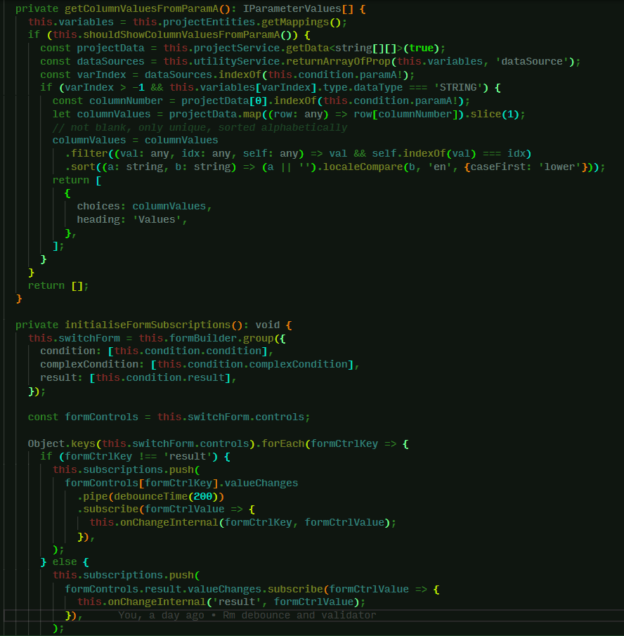

<b>A VS Code theme inspired by the terminal colour scheme.</b>

> Please note this theme is under active development. Small tweaks and refinements are still being added in the run-up to version 1.0. Please feel free to raise issues on GitHub if you notice anything that could be improved or something I have overlooked. Thanks! 👽

## Screenshots

From v0.1.4

